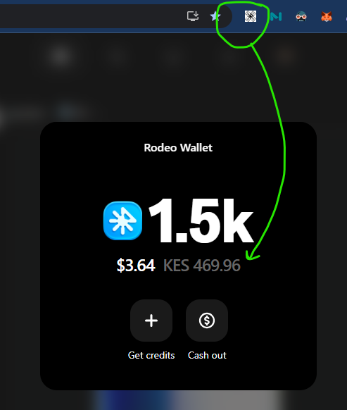
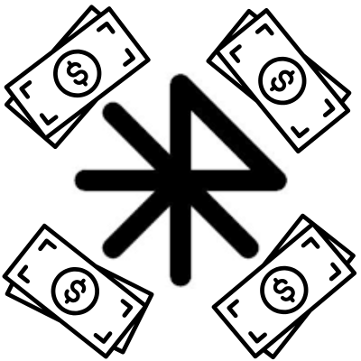

# Rodeo Wallet Currency Converter 🌍💰



A lightweight Chrome extension that automatically converts your **Rodeo Wallet** balance into your **local currency**, powered by a real-time exchange rate API.

No more quick Google searches to check what your Rodeo balance equals in your country’s money — it’s now displayed instantly within your wallet.

---

## 🚀 Features

* **Automatic Conversion**: Instantly shows your Rodeo Wallet’s USD value in your local currency.
* **Live Exchange Rates**: Uses a free, up-to-date API for accurate conversion rates.
* **One-Click Activation**: Just click the extension icon while on Rodeo and see the conversion appear.
* **Lightweight & Private**: Runs only on the Rodeo site — no background tracking or unnecessary permissions.

---

## 🧩 How to Use

1. Open [**rodeo.club**](https://rodeo.club) and log in to your account.
2. Click your profile icon → **Rodeo Wallet**.
3. Once your balance appears (e.g. `$3.64`), click the extension’s icon in your Chrome toolbar.
4. Instantly see the equivalent in your local currency appear next to your balance — no manual lookups needed.

---

## ⚙️ Installation (Developer Mode)

1. Clone or download this repository.
2. Open Chrome and go to `chrome://extensions`.
3. Enable **Developer Mode** (top-right toggle).
4. Click **Load unpacked** and select the folder containing the files:

   ```
   manifest.json
   content.js
   icon128.png
   ```
5. That’s it — your extension icon should appear in the toolbar.

---

## 🧠 How It Works

* The extension injects a small script that finds your Rodeo Wallet balance in USD.
* It fetches the latest USD-to-local-currency exchange rate from a free currency API.
* It calculates and displays the converted value (e.g. `KES 469.96`) right beside your wallet amount.

---

## 📡 API

By default, it uses [**ExchangeRate-API**](https://www.exchangerate-api.com/) for real-time conversion.
You can switch to any open currency API by updating the `fetch` URL inside `content.js`.

---

## 🖼 Icon

The extension icon (`icon128.png`) represents a minimal currency theme — you can replace it with your own 128×128 design.


---

**Built for Rodeo creators and collectors who value simplicity.**
*Convert smarter. Create freely.* 🖤
